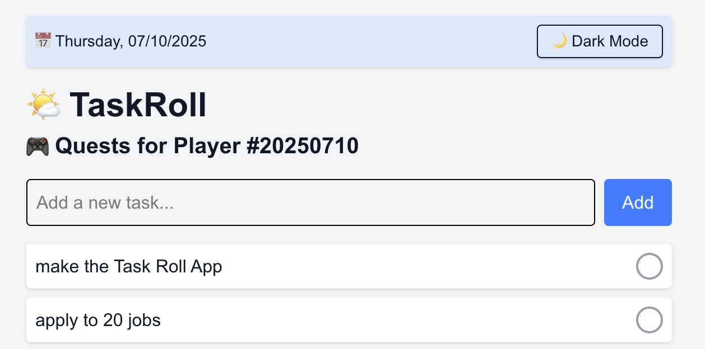
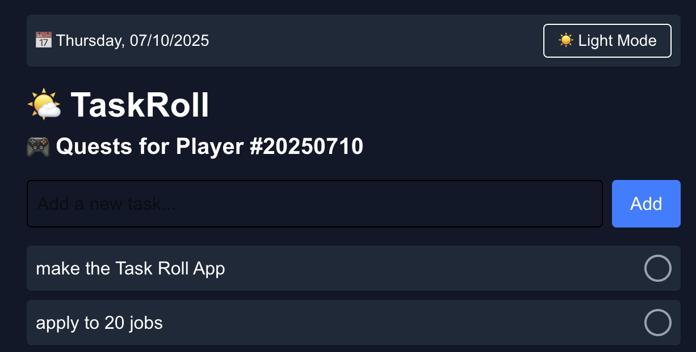

# TaskRoll

**TaskRoll** is a clean, gamified daily to-do app — built for simplicity, consistency, and fun.  
Each day, you're assigned a unique **Player Number**, and your unfinished quests (tasks) carry over to tomorrow.

🧠 Great for productivity lovers, ADHD brains, and anyone who wants to treat life like a game.

## 🔗 Live Demo

👉 [Try it now](https://task-roll-nine.vercel.app/)

### ☀️ Light Mode


### 🌙 Dark Mode


## ✨ Features

- ✅ Add and check off tasks
- 🔁 Unfinished tasks automatically carry over each day
- 📅 Displays current date + weekday
- 🎮 Daily “Player Number” based on the date (e.g., `20250710`)
- 🌗 Toggle between Light and Dark mode
- 💾 Saves locally in your browser using `localStorage`


## 🚀 Tech Stack

- [Next.js 14 (App Router)](https://nextjs.org/)
- [Tailwind CSS](https://tailwindcss.com/)
- `localStorage` (no backend!)

## 🛠 Getting Started (For Developers)

```bash
git clone https://github.com/your-username/taskroll.git
cd taskroll
npm install
npm run dev
```
